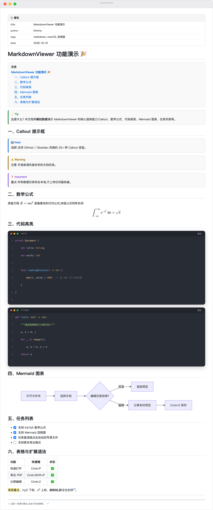
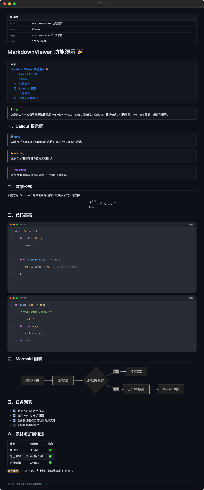

# Markdown 阅读器（Markdown Viewer）

一款原生 macOS Markdown **阅读 + 编辑**工具，致力于成为最好用的 Markdown 文档工具。基于 Swift + SwiftUI + WebKit + NSTextView 构建，无任何第三方运行时依赖，开箱即用，**完全离线**。

    [](https://github.com/fengbozhi/homebrew-tap)

## 📸 应用截图

渲染效果实拍（演示文档见 [docs/demo/showcase.md](docs/demo/showcase.md)，截图由 App 真实渲染管线生成）:

<picture>
  <source media="(prefers-color-scheme: dark)" srcset="docs/images/preview-dark.png">
  <source media="(prefers-color-scheme: light)" srcset="docs/images/preview-light.png">
  
</picture>

| 浅色模式 | 深色模式 |
|:-------:|:-------:|
|  |  |

图中演示能力：YAML Front Matter 属性面板 · `[TOC]` 目录 · Callout 提示框 · KaTeX 数学公式 · Carbon 风格代码块（复制按钮/语言标签/行号）· Mermaid 流程图 · 可点击任务列表 · 表格 · `==高亮==`/`~下标~`/`^上标^`/脚注

## ✨ 功能特性

### 编辑功能
- **三种视图模式**：预览（⌘1）/ 分屏实时预览（⌘2）/ 纯编辑（⌘3），一键切换
- **原生编辑器**：基于 NSTextView，完整支持撤销/重做、输入法、系统查找（⌘F）
- **Markdown 语法高亮**：标题/加粗/斜体/代码/链接/引用/列表/公式实时着色
- **格式化命令**：⌘B 加粗、⌘I 斜体、⇧⌘X 删除线、⌘K 链接、行内代码/代码块、H1-H3、引用、无序/有序/任务列表、**⌥⌘T 插入表格**——全部**幂等可切换**
- **智能输入**：括号/引号/反引号自动配对、选中内容按 `*`/`_` 直接包裹、回车自动续列表（有序自增、空标记回车结束列表）、Tab 缩进
- **图片粘贴**（Typora 风格）：截图/Finder 图片直接 ⌘V，自动存入文档旁 `assets/` 并插入相对路径链接
- **打字机模式**（iA Writer 风格）：编辑时光标行始终垂直居中，可在菜单中开关
- **当前行高亮**（VS Code 风格）：光标所在行柔和底色，可开关
- **数据安全三道防线**：
  1. ⌘S 原子保存（先写临时文件再替换，绝不写坏原文件），标题栏 `●` 脏标记
  2. 切换文档 / 关闭窗口时若有未保存修改 → 弹窗确认，永不静默丢稿
  3. 文件被外部修改且本地有未保存编辑 → 冲突弹窗，绝不静默覆盖
- **分屏实时预览**：编辑内容 0.35s 防抖后渲染，预览保持滚动位置

### 阅读体验
- **三栏布局**：文档列表 / 大纲面板 / 正文阅读区，左栏与大纲均可收起（状态自动记忆）
- **完整渲染**：基于 [marked.js](https://github.com/markedjs/marked) + [GitHub 风格样式](https://github.com/sindresorhus/github-markdown-css)，完整支持 GFM 语法
- **数学公式**：内置 [KaTeX](https://katex.org)，`$行内$` 与 `$$块级$$`（Pandoc 规则，`$100 到 $200` 价格不会误判）
- **Mermaid 流程图**：```mermaid``` 代码块自动渲染为图表
- **Callout 提示框**（GitHub/Obsidian 风格）：`> [!NOTE]` `> [!TIP]` `> [!IMPORTANT]` `> [!WARNING]` `> [!CAUTION]` 等 20+ 类型，彩色图标 + 边框
- **Emoji 短代码**：`:smile:` → 😄，内置 170+ 常用短代码映射（GitHub/Obsidian 风格）
- **YAML Front Matter 属性面板**（Obsidian Properties 风格）：文档头部 `---` 元数据渲染为属性表格，支持数组展开
- **任务列表可点击**（Typora 风格）：渲染区直接点击复选框，**自动回写源文件**（干净文档直接落盘，有未保存编辑时只改缓冲区）
- **扩展语法**：`==高亮==`、`~下标~`、`^上标^`、`[^脚注]`、`[TOC]` 目录（可点击跳转）
- **平滑滚动**：锚点跳转（TOC/脚注/大纲）平滑过渡，尊重系统"减弱动态效果"设置
- **标题锚点**：hover 标题显示 GitHub 风格 `¶` 链接，点击即可复制章节定位
- **宽表格自适应**：内容超宽时表格内部横向滚动，不撑破版面
- **深色模式**：一键切换明暗主题，编辑器与渲染区同步适配，加载无白闪
- **图片高清显示**：双击图片弹窗全屏查看，支持缩放与拖动

### 效率功能
- **快速打开**（⌘P，Obsidian/VS Code 风格）：模糊搜索文件名与标题，↑↓ 导航、回车跳转、Esc 关闭
- **大纲导航**：点击平滑跳转；滚动时大纲自动高亮当前章节
- **文件自动重载**：外部编辑器保存后自动刷新，保持滚动位置；目录增删文件自动刷新列表
- **代码块增强**：Carbon 风格窗口 + 语言标签 + 一键复制按钮 + 行号
- **文档内查找**（⌘F）：全部命中高亮，回车逐项跳转，显示"第 n / 共 m 处"
- **底部状态栏**：字数 / 字符 / 行数统计 + 预计阅读时长 + 阅读进度百分比，顶栏下方附 2pt 阅读进度条
- **字体缩放**：⌘+ / ⌘- / ⌘0（编辑器与渲染区同步生效），50% ~ 200%
- **导出独立 HTML**（⌘⇧E）：图片与字体内嵌 base64，单文件可直接分发
- **导出 PDF**（⌘⇧P）：整页捕获渲染结果，保留全部排版样式，代码块/表格自动避免跨页截断
- **在 Finder 中显示**（⌘⇧R）/ **用默认编辑器打开**（⌘⇧O）/ **打印**
- **会话记忆**：自动恢复上次打开的文件夹、选中状态、面板开关、主题、缩放与视图模式

## 🚀 快速开始

### 方式一：Homebrew 安装（推荐）

```bash
brew install --cask fengbozhi/tap/markdownviewer
```

升级与卸载：

```bash
brew upgrade --cask markdownviewer      # 升级到新版本
brew uninstall --cask markdownviewer    # 卸载
```

> Cask 维护在 [fengbozhi/homebrew-tap](https://github.com/fengbozhi/homebrew-tap),随每次 Release 同步更新。

### 方式二：直接下载

从 [Releases](../../releases) 下载 `MarkdownViewer-x.y.dmg`，打开后把 **Markdown Viewer** 拖入「应用程序」文件夹即可。

> 首次打开若提示"无法验证开发者"：右键点击应用 →「打开」，或在「系统设置 → 隐私与安全性」中允许。

### 方式三：从源码构建

```bash
git clone https://github.com/fengbozhi/markdown-viewer.git
cd markdown-viewer
./build.sh        # 构建前自动运行 67 项单元测试,失败即中止
```

**环境要求**：macOS 13+，Xcode Command Line Tools（`xcode-select --install`）

## 📁 项目结构

按软件工程规范分层组织，核心逻辑纯函数化、可测试：

```
markdown-viewer/
├── src/
│   ├── App/MarkdownViewerApp.swift      # App 入口、生命周期、菜单栏命令
│   ├── Models/
│   │   ├── DocItem.swift                # 文档条目模型
│   │   ├── Heading.swift                # 大纲模型 + 文本规范化
│   │   ├── ViewMode.swift               # 预览/分屏/编辑模式
│   │   ├── DocStats.swift               # 字数/字符/行数统计
│   │   └── FuzzyMatch.swift             # 快速打开模糊匹配打分
│   ├── Editing/                         # 编辑器核心(纯函数,不依赖 AppKit)
│   │   ├── EditorCommands.swift         # 格式化命令/表格插入/列表续行/自动配对
│   │   ├── MarkdownHighlighter.swift    # 语法高亮 token 提取
│   │   └── TaskToggle.swift             # 任务复选框翻转(点击回写)
│   ├── Rendering/
│   │   ├── MarkdownRenderer.swift       # Markdown → HTML 渲染管线(16 步)
│   │   └── LocalFileSchemeHandler.swift # local:// 本地资源协议
│   ├── Services/
│   │   ├── FolderStore.swift            # 文件夹数据仓库
│   │   ├── EditorDocument.swift         # 文档状态/脏标记/原子保存
│   │   ├── FileWatcher.swift            # 文件/目录变更监听
│   │   └── ImagePasteService.swift      # 图片粘贴 → assets/ + 相对链接
│   ├── Views/
│   │   ├── ContentView.swift            # 主界面/快速打开/导出/数据安全防护
│   │   ├── QuickOpenView.swift          # ⌘P 快速打开面板(模糊搜索)
│   │   ├── SidebarView.swift            # 文档列表侧栏
│   │   ├── OutlineView.swift            # 大纲面板(滚动同步)
│   │   ├── DetailView.swift             # 三模式内容区/查找栏/状态栏
│   │   ├── MarkdownWebView.swift        # WKWebView 封装(文件/内存双渲染源)
│   │   ├── MarkdownEditorView.swift     # NSTextView 编辑器(打字机/行高亮/图片粘贴)
│   │   └── ImagePopup.swift             # 图片全屏弹窗
│   └── Resources/                       # 渲染引擎(完全离线)
│       ├── marked/highlight/mermaid/katex + 样式
│       └── fonts/                       # KaTeX woff2 字体(20 个,296KB)
├── tests/
│   ├── main.swift                       # 编辑器单元测试(67 用例,构建门禁)
│   ├── render_harness.swift             # 渲染 HTML 生成器
│   ├── render_e2e.js                    # 渲染管线端到端测试(42 断言,jsdom)
│   └── README.md                        # 测试运行说明
├── build.sh                             # 一键构建(测试 → 编译 → 打包 → 签名)
└── README.md
```

## 🔧 质量保障

- **单元测试**：编辑器格式化命令、表格插入、任务复选框翻转、模糊匹配、文档统计、列表续行、自动配对、语法高亮均为纯函数，67 个用例覆盖正常/边界/幂等路径，作为 `build.sh` 构建门禁
- **端到端测试**：渲染管线（marked/KaTeX/Mermaid/TOC/脚注/Callout/Emoji/Front Matter 等 16 步）在 jsdom 中执行真实产物并做 42 项断言（含样式、交互与可读性回归）
- **防御式设计**：脏标记是计算属性（`text != savedText`，不可能状态不一致）；原子保存；外部冲突永不静默覆盖；超过 30 万字符的文档编辑器只高亮可视区域；渲染层数据表用函数声明提升包裹，避免执行时序陷阱

## 🗺️ 功能路线图

- [x] KaTeX 数学公式渲染
- [x] [TOC] 目录 / 脚注 / 高亮 / 上下标扩展语法
- [x] 文件变更自动重载
- [x] 导出独立 HTML / 导出 PDF
- [x] 编辑功能（三种模式 / 语法高亮 / 格式化命令 / 智能输入 / 数据安全）
- [x] Callout 提示框 / Emoji 短代码 / Front Matter 属性面板
- [x] 任务列表点击回写 / 图片粘贴 / 插入表格
- [x] 快速打开 ⌘P / 打字机模式 / 当前行高亮
- [ ] 文件夹嵌套子目录树
- [ ] 多标签页
- [ ] 跨文件全文搜索
- [ ] 编辑器与预览滚动同步
- [ ] 壁纸级自定义主题

## 📄 许可证

[MIT](LICENSE)

渲染引擎版权归属：
- [marked](https://github.com/markedjs/marked) — MIT © Christopher Jeffrey
- [highlight.js](https://github.com/highlightjs/highlight.js) — BSD-3-Clause
- [mermaid](https://github.com/mermaid-js/mermaid) — MIT
- [KaTeX](https://github.com/KaTeX/KaTeX) — MIT © Khan Academy
- [github-markdown-css](https://github.com/sindresorhus/github-markdown-css) — MIT © Sindre Sorhus
