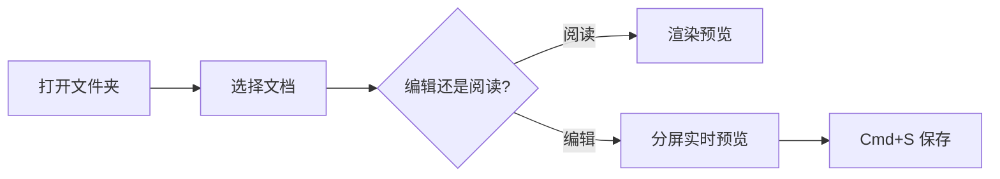

# MarkdownViewer 功能演示 :tada:

[TOC]

> [!TIP] 这是什么?
> 本文档用**模拟数据**演示 MarkdownViewer 的核心渲染能力:Callout、数学公式、代码高亮、Mermaid 图表、任务列表等。

## 一、Callout 提示框

> [!NOTE] 说明
> 支持 GitHub / Obsidian 风格的 20+ 种 Callout 类型。

> [!WARNING] 注意
> 升级前请先备份你的文档目录。

> [!IMPORTANT] 重点
> 所有数据仅保存在本地,不上传任何服务器。

## 二、数学公式

质能方程 $E = mc^2$ 是最著名的行内公式,块级公式同样支持:

$$
\int_{-\infty}^{+\infty} e^{-x^2} \, dx = \sqrt{\pi}
$$

## 三、代码高亮

```swift
struct Document {
    let title: String
    var words: Int

    func readingMinutes() -> Int {
        max(1, words / 400)  // 按 400 字/分钟估算
    }
}
```

```python
def fib(n: int) -> int:
    """斐波那契数列(示例代码)"""
    a, b = 0, 1
    for _ in range(n):
        a, b = b, a + b
    return a
```

## 四、Mermaid 图表



## 五、任务列表

- [x] 支持 KaTeX 数学公式
- [x] 支持 Mermaid 流程图
- [x] 任务复选框点击自动回写源文件
- [ ] 支持更多导出格式

## 六、表格与扩展语法

| 功能 | 快捷键 | 状态 |
|:-----|:------:|:----:|
| 快速打开 | Cmd+P | ✅ |
| 导出 PDF | Cmd+Shift+P | ✅ |
| 分屏编辑 | Cmd+2 | ✅ |

==高亮重点==、H~2~O 下标、x^2^ 上标、~~删除线~~,脚注也支持[^demo]。

[^demo]: 这是一条演示脚注,点击可双向跳转。
